# Seafoam Winter E-commerce Store

This website offers visitors the chance to browse and buy knitwear made by Belgian/Welsh knitter Stien. Visitors can also create a user profile, leave reviews and add products to their favourites.
The seller can showcase her handmade knitwear and offer a wide range of choices to the user.

Seafoam winter is created as my final milestone project for the Level 5 Diploma in Web Application Development by Code Institute. This website was built with the help of the walk through project 'Boutique Ado' by [Code Institute](https://codeinstitute.net/).

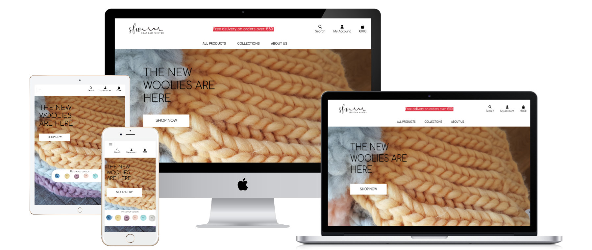 

## **Table of Contents:**
---

- [User Experience (UX)](#user-experience)
    - [Strategy](#strategy)
    - [Scope](#scope)
    - [Structure](#structure)
    - [Skeleton](#skeleton)
    - [Surface](#surface)
- [Features](#features)
- [Technologies Used](#technologies-used)
    - [Languages Used](#languages-used)
    - [Frameworks, Libraries & Programs Used](#frameworks-libraries--programs-used)
- [Testing](#testing)
    - [Automatic Testing](#automatic-testing)
    - [Manual Testing](#manual-testing)
- [Deployment](#deployment)
    -  [Hosting of database on ElephantSQL](#hosting-of-database-on-elephantsql)
    -  [Heroku Set Up for database](#heroku-set-up-for-database)
    -  [Connect the database](#connect-the-database)
    -  [Adjust settings](#adjust-settings)
    -  [Set up automatic deployment in Heroku when pushing to Github](#set-up-automatic-deployment-in-heroku-when-pushing-to-github)
- [Credits and Resources](#credits--resources)
    -   [Content](#content)
    -   [Media](#media)

# User Experience

## _Strategy_

Seafoam Winter is a B2C e-commerce website, where creator/knitter Stien can offer her knitwear to potential customers. In return, the store owner can receive reviews from customers to add social proof. The customers can shop in a unique way by selecting their favourite colour on the homepage. In only 3 clicks from the homepage, the customer's product of choice can be in their shopping bag ready for purchase.

## _Scope_

Possible features were rated in order of importance and viability (1-5 with 5 as most important/viable). 
The highest scorers were recognised as MVP's and were prioritised. 
Features that were delivered can also be viewed [here](#features).

| Feature | Importance | Viability | MVP | Delivered |
| --- | --- | --- | --- | --- |
| **User Features** | | | | |
| Collection Page | 5 | 5 | MVP | ✅ |
| Product Page | 5 | 5 | MVP | ✅ |
| Shopping Cart | 5 | 5 | MVP | ✅ |
| Checkout/Payments | 5 | 5 | MVP | ✅ |
| User Account | 5 | 5 | MVP | ✅ |
| Profile Page | 4 | 5 | | ✅ |
| Order History | 4 | 5 | | ✅ |
| Reviews | 3 | 4 | | ✅ |
| Favourites | 3 | 3 | | ✅ |
| Sorting | 4 | 5 | | ✅ |
| Filtering and searching | 4 | 5 | | ✅ |
| Custom Order Page | 3 | 4 | | |
| Contact Page | 4 | 5 | | ✅ |
| **Shop Owner Features** | | | | |
| CRUD functionality on products | 5 | 5 | MVP | ✅ |
| View Orders | 5 | 5 | MVP | ✅ |
| View Users (CRUD) | 5 | 5 | MVP | ✅ |
| Delete Unwanted Reviews | 4 | 5 |  | ✅ |
| Blog Page | 3 | 3 |  | |

[Back to top](#table-of-contents)

## _Structure_

### **User Stories**

- ### **First Time Visitor Goals:**
1. As a first time user, I want to find out the purpose of the website immediately.
2. As a first time user, I want to find out what products are available.
3. As a first time user, I want to find out how I can buy the products and buy them.

- ### **Returning Visitor Goals:**
1. As a returning user, I want to find out how I can search and filter for specific products.
2. As a returning user, I want to access my profile and view previous orders.
3. As a returning user, I want to access my profile and edit info kept on file.
4. As a returning user, I want to save my favourite products.

- ### **Frequent User Goals:**
1. As a frequent user, I want to be able to write or read a review about a product.
1. As a frequent user, I want to find out how I can get in touch with the maker for custom orders.

- ### **Store Owner Goals:**
1. As the store owner, I want to showcase my products to potential customers.
1. As the store owner, I want visitors to be able to buy my product.
1. As the store owner, I want to be able to edit and delete all reviews to avoid spam.

[Back to top](#table-of-contents)

### **Data Structure**

The data for the website is stored in 2 places

[Elephant SQL](https://www.elephantsql.com/):

The database is migrated and stored with ElephantSQL. (see deployment section)
It consists of databases Categories and Products, but also all necessary data for the users, orders and authentication procedures.

[AWS S3](https://aws.amazon.com):

Amazon S3 Buckets are used to store static files and media used across the website.

### **Database models**

There are 8 models on which the website runs:

-   Products: contains the details of each product.
-   Category: enables the sorting of products in categories.
-   UserProfile: contains user information such as delivery address.
-   User: Django's own model linked to other models such as UserProfile, Reviews and Favourites.
-   Order: contains the order information. This is linked to the UserProfile, so users can view their previous order on their profile page.
-   OrderLineItems: contains the products per order.
-   Reviews: enables the user to leave a review on a product.
-   Favourites: linked to user and product, so users can add a specific product to their favourites.

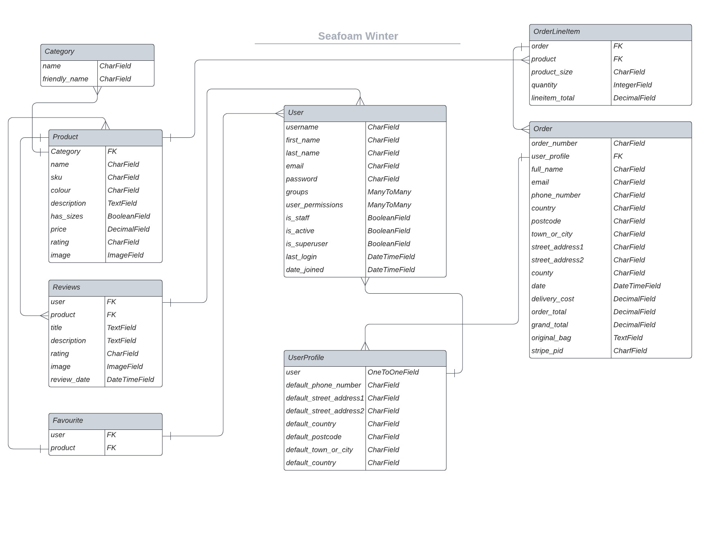 

[Back to top](#table-of-contents)

## _Skeleton_

### _Wireframes_

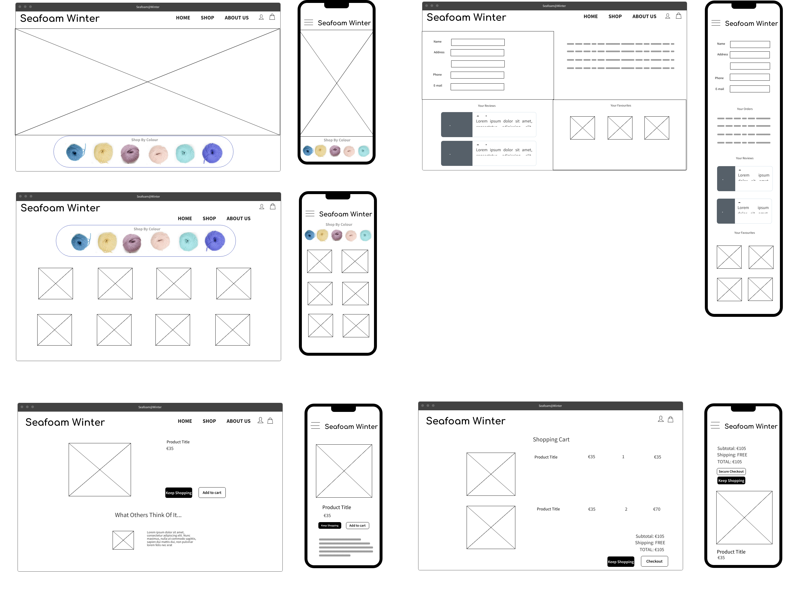 

Wireframes for homepage, products, profile page and shopping cart.
Made with [Mockflow](https://wireframepro.mockflow.com/).

[Back to top](#table-of-contents)

## _Surface_

- ### **Typography**

    <strong>Choice of font:</strong> Comfortaa, [Google Fonts](https://fonts.google.com/). Easy to read, clear but not boring. 
    Headings: Comfortaa was also used for the headings but it was capitalised to make a distinction. 

- ### **Colourscheme**

    For clarity a simple black and white colour theme was chosen with accents in red, to draw attention. (e.g. shipping info on homepage) 
    As the knitwear comes in so many beautiful colours, I felt the use of colour in the design of the website would distract from the product sold, or even clash with the product colours. Instead I kept it rather minimalistic. This aids the customer in navigating around the site and chosing their favourite product colours easily.

- ### **Images**

    On the homepage the logo is visible in the header, but not too overpowering.

     

    There is a hero image with focus on the thickness, softness and colour of the wool.
    The selling points of the knitwear sold on the website.

    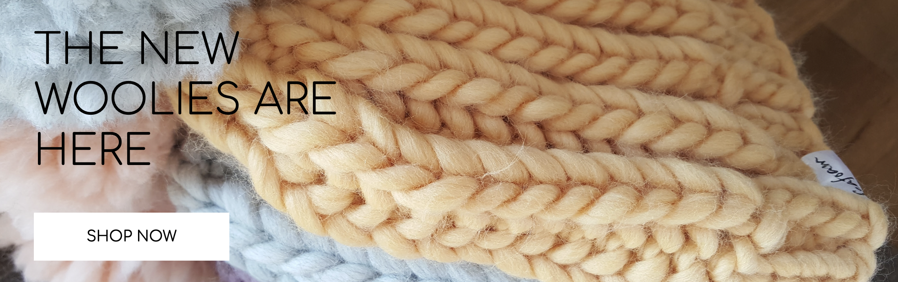 

    Product images are kept uniform across the webstore with mostly the same background,
    to keep the focus on the product itself.

    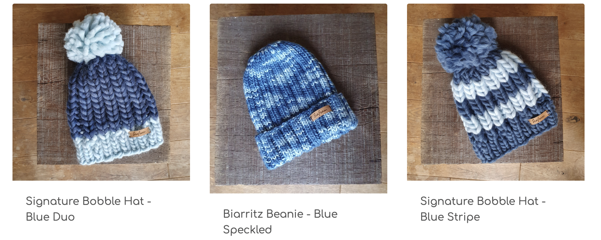 

[Back to top](#table-of-contents)

## _Features_

### **Existing Features**

- __Clear Navigation and purpose__

    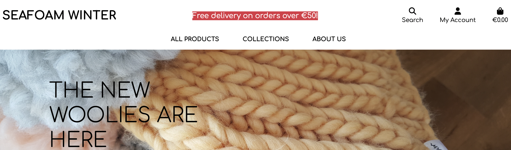 

    Covering user stories: As a first time user, I want to find out the purpose of the website immediately.

- __Product Browsing and Filtering__

    The User can browse the products in many different ways. By collection, filtering and searching.

    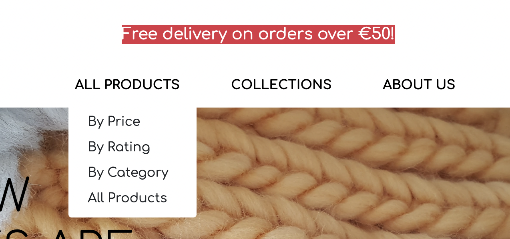 
    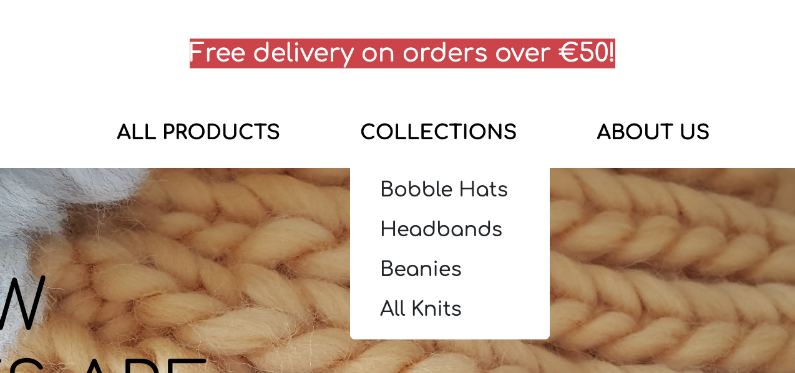 
    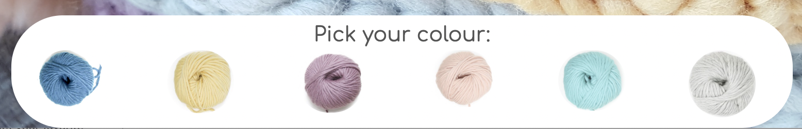 
    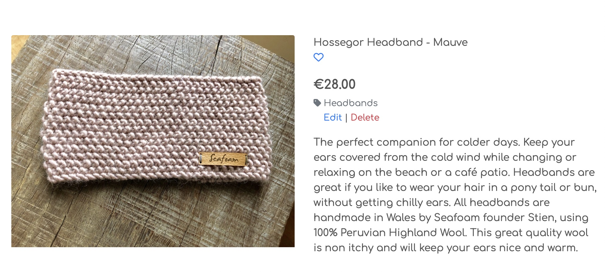 

    Covering user stories: 
    -   As a first time user, I want to find out what products are available.
    -   As a returning user, I want to find out how I can search and filter for   specific products.
    -   As a returning user, I want to save my favourite products.
    -   As a frequent user, I want to be able to write or read a review about a product.

[Back to top](#table-of-contents)

- __User Accounts__

    Users can log in to view their profile: address details, previous orders, the reviews they have written and the products they have added to their favourites.

    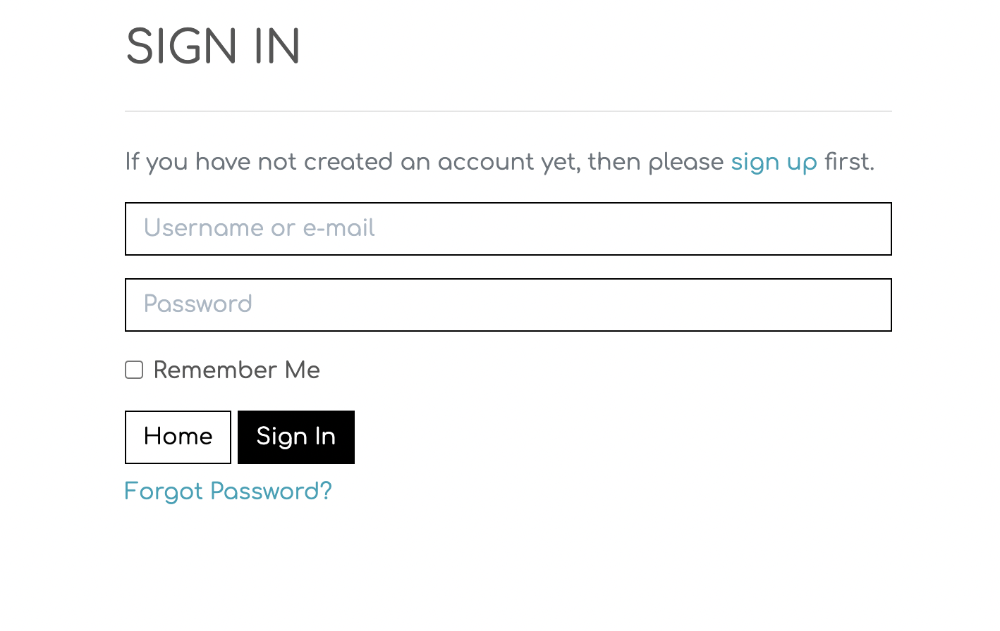 

    Covering user stories:
    -   As a returning user, I want to access my profile and view previous orders.
    -   As a returning user, I want to access my profile and edit info kept on file. 

     

    Covering user stories:
    -   As a returning user, I want to save my favourite products.
    -   As a frequent user, I want to be able to leave a review about a product.

     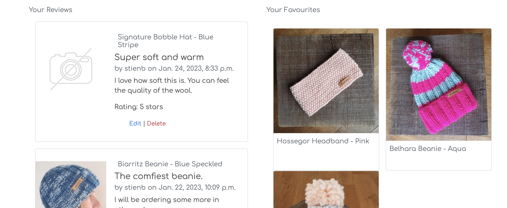    

[Back to top](#table-of-contents)

- __Shopping Bag__

    Users can add products to bag and can view a snippet of the bag whenever new products are added.

    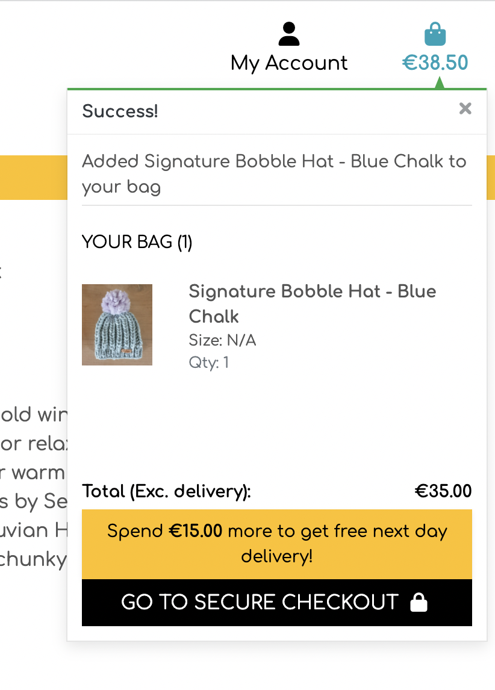 

    Covering user stories: As a first time user, I want to find out how I can buy the products and buy them.

     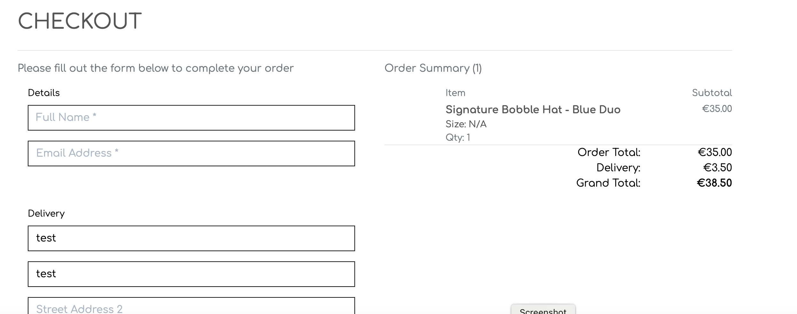 

- __About Page__

    Covering user stories: As a frequent user, I want to find out how I can get in touch with the maker for custom orders.

     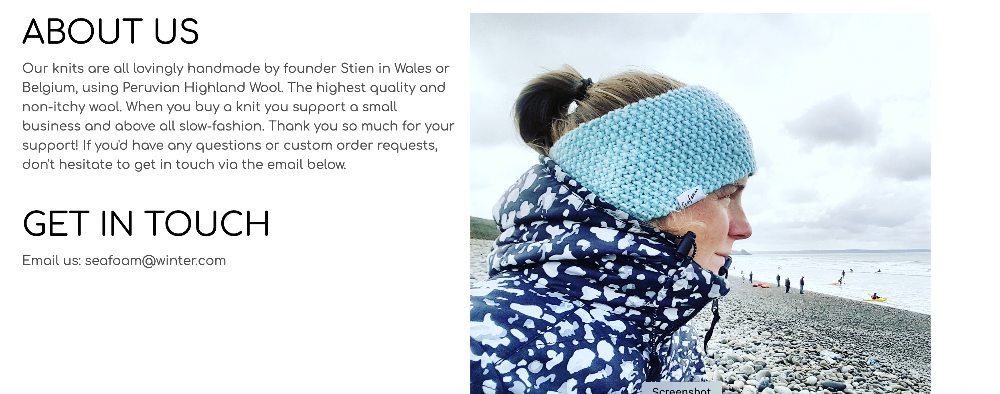 

### **Features Left To Implement**

- __Custom order form__

    A specific order form where users can make custom orders.

[Back to top](#table-of-contents)

# Technologies Used

## _Languages Used_

-   [HTML5](https://en.wikipedia.org/wiki/HTML5)
-   [CSS3](https://en.wikipedia.org/wiki/Cascading_Style_Sheets)
-   [Javascript](https://en.wikipedia.org/wiki/JavaScript)
-   [jQuery](https://en.wikipedia.org/wiki/JQuery)
-   [Python](https://en.wikipedia.org/wiki/Python_(programming_language))

## _Frameworks, Libraries & Programs Used_

1. [Django:](https://www.djangoproject.com/)
    - Django was used for the structure of the backend.
1. [Bootstrap:](https://getbootstrap.com/docs/5.1/getting-started/introduction/)
    - Bootstrap was used on parts of the website to make them responsive.
1. [Gitpod:](https://gitpod.io/workspaces)
    - Gitpod workspace was used to create and edit code and push them onto the Github repo.
1. [GitHub:](https://github.com/)
    - GitHub is used to store the projects code after being pushed from Gitpod.
1. [Heroku:](https://www.heroku.com/)
    - Heroku is used to deploy and host the website.
1. [Hover.css:](https://ianlunn.github.io/Hover/)
    - Hover.css was used on to add float effect on buttons.
1. [Google Fonts:](https://fonts.google.com/)
    - Google fonts was used to import the 'Comfortaa' font into the style.css file.
1. [Font Awesome:](https://fontawesome.com/start)
    - Font Awesome was used for icons across the website (e.g. the favourites 'heart')
1. [Elephant SQL:](https://www.elephantsql.com)
    - Elephant SQL is used to host the database.
1. [AWS:](https://aws.amazon.com)
    - AWS S3 is used to store static files like images and files.
1. [Stripe](https://stripe.com/en-gb-be)
    - Stripe is used to enable card payments on the webshop.

[Back to top](#table-of-contents)

# Testing 

## _Automatic Testing_

- [HTML](https://jigsaw.w3.org/css-validator/#validate_by_input)
    No errors, with exception of template logic
- [CSS](https://jigsaw.w3.org/css-validator/)
    No errors found
- [Python Checker](https://www.pythonchecker.com)
    Python Checker was used to check if code is PEP8 compliant

## _Manual Testing_

The website was extensively manually tested on different devices in the developing process. The user stories were followed and bugs fixed as I came across them in development: 

-   I browsed the products using the navigation links and adjusted the order to see if the products re-arrange on the page.
-   I filtered by colour by clicking on the wool colour, both on home page as on the products page.
-   I navigated to About Us. Found and fixed bug to send email by clicking on emailaddress.
-   Later I tested the navigation menu on mobile. A bug was found: there was no link back to homepage. Tis was fixed by adding a 'Home' link in the hamburger menu.
-   I logged in as admin, tested CRUD functionality on products and changed personal details to see if they save correctly.
-   I registered a new account to see if registration emails are sent. Then I clicked on the confirmation link provided to confirm the address. Django's backend was checked to see if the confirmation came through.
-   I navigated to the profile page to see if previous orders show up correctly.
-   Test Orders were completed, with many different possibilities and information entered to check whether it would throw errors.
A bug was found: images were not showing correctly in the 'add to cart' toast and on the checkout page. The issue was an incorrect url to the image files. The bug was fixed.
There was also an issue with totals not coming through in the backend, this was a small bug in the signals and has been fixed.
- Reviews were tested for CRUD functionality by logging in and leaving reviews. Then checking the profile and product to see if they were showing correctly. Edit and delete functionality was tested. Then logged out and in as different user to see how the reviews behaved. An issue with the rating was solved, the review model was adjusted so there was a maximum rating of 5 allowed.
- While testing the reviews, I realised that if some one left bad reviews on purpose or as some kind of spam, the shop owner would have no ability to review or delete these. So I added the CRUD ability of the reviews to the superusers as well.
- Products were added to favourites and viewed on the profile page. There was an issue with repeat addition to the list and the styling of the heart icon. But after many trial runs it finally worked as it should. The heart is filled when the product is in the user's favourites and not filled when deleted or not yet added. The user gets the appropriate message when added or deleted. When a user is not signed in and presses the icon, they are redirected to the sign in page. 

Many smaller bugs were fixed during the development process as I came across them. One of the big issues after deployment was the URLs to the static files on the AWS server. After plenty of digging I finally managed to get the urls linked up correctly.

[Back to top](#table-of-contents)

# Deployment

This project was developed on Gitpod, committed to Git and pushed onto the [Github repository](https://github.com/StienBoodts/horizon-animatie-CI-MP2) using Bash. 

## Hosting of database on ElephantSQL

1. log into [Elephant SQL](https://www.elephantsql.com/)
2. click 'Create New Instance'
3. Give a name and choose the free 'Tiny Turtle' plan, tags can be left blank
4. Select region closest to you
5. click 'Review'
6. then 'Create Instance'
7. return to Elephant SQL database and click database instance for the project
8. copy the database URL
9. Leave tab open, you'll need this in deployment later.

## Heroku set up for database

1. log into [Heroku](https://www.heroku.com/)
2. Click New to create a new app
3. Give the app a name and select region closest to you
4. Cick 'Create app'
5. Open settings tab
6. Add the config var DATABASE_URL, and for the value, copy in your database url from ElephantSQL
7. Leave tab open, you'll need this in deployment later.

[Back to top](#table-of-contents)

## Connect the database

1. in the Gitpod terminal, install dj_database_url and psycopg2, both of these are needed to connect to your external database: pip3 install dj_database_url==0.5.0 psycopg2
2. Update your requirements.txt file with the newly installed packages: pip freeze > requirements.txt
3. In your settings.py file, import dj_database_url underneath the import for os
4. Scroll to the DATABASES section and update the code so sqlite3 is commented out and we connect to the new ElephantSQL database instead. Paste in your ElephantSQL database URL. (DO NOT COMMIT)
5. In the terminal, run the showmigrations command to confirm you are connected to the external database
6. Migrate your database models to your new database
7. Load in the fixtures. Please note the order is very important here. We need to load categories first
8. Then products, as the products require a category to be set
9. create a new superuser for your new database
10. to prevent exposing our database when we push to GitHub, delete the url again from our settings.py - set it up using an environment variable
11. On the ElephantSQL page for your database, in the left side navigation, select “BROWSER”
12. Click the Table queries button, select auth_user
13. When you click “Execute”, you should see your newly created superuser details displayed. This confirms your tables have been created and you can add data to your database

##### Adjust settings
1. Make sure both databases are connected with an if statement
2. install gunicorn and add it to the requirements
3. Create Procfile
4. log into heroku in the terminal
5. enter heroku config:set DISABLE_COLLECTSTATIC=1 --app with app name added to the end
6. Add host name to Heroku app in allowed host in settings.py (also add local host)
7. Commit and push changes to gitpod
8. initialise heroku app: heroku git:remote -a and name of app
9. push changes to heroku main

## Set up automatic deployment in Heroku when pushing to Github
1. Go to app in Heroku and navigate to deploy tab
2. Click Connect to github, Search for the repo and Click Connect
3. Enable automatic deploys

[Back to top](#table-of-contents)

# Credits & Resources

## _Content_ 

1. [Code Institute](https://codeinstitute.net/)
    - this project was based on the walkthrough project Boutique Ado from Code Institute.
1. [Slack Community]()
    - General trouble shooting to fix bugs in development
1. [Stack Overflow](https://stackoverflow.com/)
    - General searches to solve issues
1. [Django Documentation](https://docs.djangoproject.com/en/4.1/)
    - Help with the backend structure of the Django apps

## _Media_

1. Developers own :)

[Back to top](#table-of-contents)